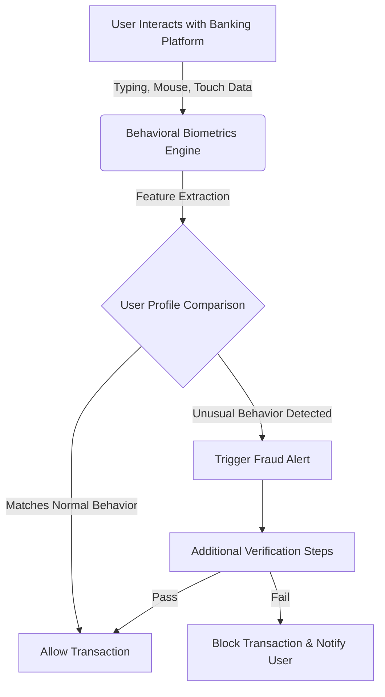
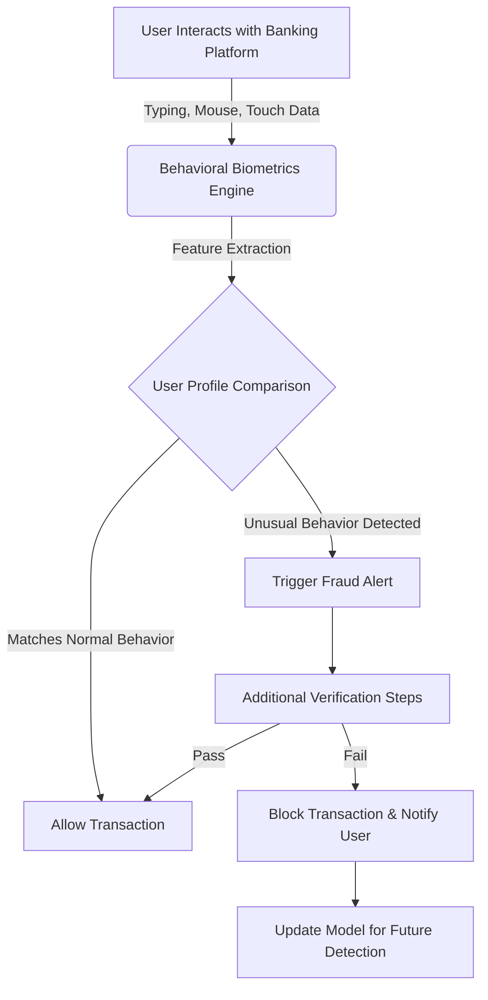
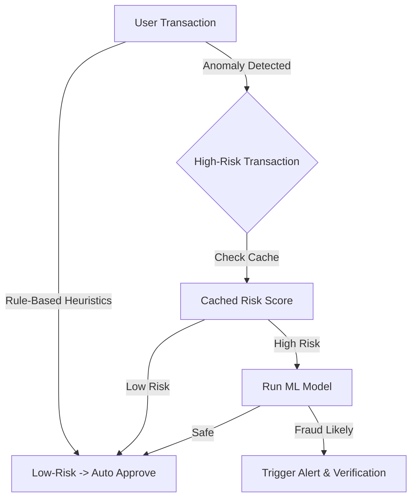

# Aryan’s Assessment

## Q1 (Invisible Bug)

### Task 1 (Reasons)

Here are three potential reasons for the decline in fraud detection accuracy and the unpredictable response times:

#### (a) Feature Extraction Corruption

A bug in the feature engineering pipeline (e.g., processing transaction history, location, or device fingerprinting) introduced errors like missing values, incorrect encodings, or corrupted data, degrading the model’s predictions and slowing down processing.

#### (b) API Latency and Accuracy Drop

The system depends on an external service, like a geolocation API or device fingerprinting service, which, after deployment, began to provide slower or less accurate responses due to its own issues like Network Issues, affecting both latency and accuracy.

#### (c) Overzealous Caching or Stale Data

A caching mechanism may have been introduced or misconfigured, resulting in the API serving outdated fraud scores or feature data instead of real-time results, leading to inaccurate predictions and inconsistent response times.

----------

### Task 2 (Debugging)

#### **A: Feature Extraction Corruption**

##### **Step-by-Step Debugging:**

1.  **Log Feature Data:** Capture raw input data, such as transactions and locations, along with processed features like normalized values and encoded fingerprints from before and after deployment.
2.  **Compare Outputs:** Validate the processed features against expected formats, ensuring there are no nulls and that values fall within correct ranges, using assertions or a data diff tool.
3.  **Trace Pipeline Code:** Review recent changes in the ETL or preprocessing scripts by using `git diff` and check library versions for any breaking changes, such as those in `pandas` or `numpy`.
4.  **Test in Isolation:** Execute the pipeline against a small dataset offline and verify the outputs against a known good state, referencing pre-deployment logs.
5.  **Resolution:** Repair the bug by rolling back a faulty update or handling edge cases, reprocess the data, and redeploy the fixed pipeline.

#### **B: API Latency and Accuracy Drop**

##### **Step-by-Step Debugging:**

1.  **Monitor External Calls:** Post-deployment, I will look at the logs for the response time, error codes, and payload sizes from the third-party API.
2.  **Test Independently:** Send test requests to the external service, using tools like Postman or `curl`, and compare latency and accuracy before and after deployment.
3.  **Contact Provider:** Visit the third-party API’s status page or changelog for outages, rate limits, and data quality problems that were reported.
4.  **Fallback Test:** Temporarily simulate the external API with static data (e.g., cached responses) and observe if the system’s performance improves.
5.  **Resolution:** Switch to a backup provider, implement retry logic with exponential backoff, or cache reliable responses locally until the service stabilizes.

#### **C: Overzealous Caching or Stale Data**

##### **Step-by-Step Debugging:**

1.  **Inspect Cache Config:** Examine caching layers like Redis, Memcached TTL, eviction policies, and key patterns.
2.  **Log Cache Behavior:** Track cache hits or cache misses and monitor the age of cached data (last updated timestamp, etc.).
3.  **Simulate Traffic:** Generate controlled requests, measure responses with and without cache, and compare freshness.
4.  **Force Refresh:** Set a shorter TTL and observe if accuracy and latency return to normal or clear the cache.
5.  **Resolution:** Update the cache invalidation strategy (e.g., invalidate cache when transactions close) or disable caching for critical transactions at runtime.

----------

### Task 3 (Additional Feature to be Added)

#### **User Behavioral Biometrics**

##### **Description:**

Implement a new feature to record how users interact with the banking platform while completing transactions. This involves analyzing **keystroke dynamics, mouse movement curves, and touchscreen gestures**. We can create a signature for each user using behavioral biometrics.

##### **Why It Helps:**

Fraudsters often use scripts and stolen credentials to mimic legitimate users. However, real humans interact with web applications differently. By training a model to detect anomalies in **behavioral biometrics** alongside transaction history, fraud detection can be enhanced.

##### **Implementation:**

1.  **Data Collection:** Use a **client-side JavaScript snippet** for web applications or an **SDK for mobile applications** to gather behavioral data.
2.  **Feature Engineering:** Aggregate data into a feature vector, including:
    -   **Typing speed and pressure**
    -   **Mouse movement and click frequency**
    -   **Touchscreen gestures and swipes**
3.  **Integration:** Add behavioral biometric features into the model’s input layer.

##### **Impact:**

-   Detect **account takeovers** by differentiating between normal user behavior and fraudsters.
-   Enhance **security** without affecting user experience.
-   Reduce **false positives** in fraud detection.

##### **Explanation of Approach:**

I selected these new reasons to highlight specific failure points in a production AI system:

1.  **Data processing errors** (pipeline corruption)
2.  **External dependencies** (third-party APIs)
3.  **Optimization missteps** (caching)

Debugging is an **iterative process**, beginning with **log and configuration analysis**, followed by **isolation tests and comparisons**, and ending with **verification** through simulations. By introducing behavioral biometrics, we can further strengthen fraud prevention.

----------
##### **Explanation of Approach:**

------
### **Model Drift Monitoring and Adaptation**

##### **Problem:**
Model drift happens when the predictive capability of a model  deteriorates  over  time  because  of  changes in the real  world, e.g.,  changing  fraud patterns. There are two forms of model drift:  
  
1. **Concept Drift:** The mapping between features and fraud labels shifts, rendering  historical fraud patterns irrelevant.  
2. **Data Drift:** The distribution of input features shifts  because  of user behavior changes or external influences.  
  
##### **Causes of Model Drift:**  
  
- Shifts in the online  space, including  emerging  fraud methods.  
- Trends  in user behavior and transaction flows that change over time.  
- Exogenous events (e.g., a pandemic changing  consumer  behavior).  
  
##### **Drift Detection Methods:**  
  
1. **Continuous Evaluation:** Regularly compare model performance on newly annotated test data.  
2. **Population Stability Index (PSI):** Calculate distribution shifts; values > 0.2 show significant drift.  
3. **Z-Score Analysis:** Detect statistical changes in feature distributions; a z-score beyond ±3 signals potential drift.  
  
##### **Automated Model Updates:**  
  
- **Monitoring Pipelines:** Set up alerts for drift detection using predefined thresholds.  
- **Automated Retraining:** Implement a retraining pipeline that updates models when drift is detected.  
- **Feedback Loop:** Incorporate user feedback from flagged fraudulent transactions to refine the model.  
- **Adaptive Deployment:** Dynamically  utilize ensemble learning to blend  previous and new models.  
  
##### **Impact:**  
  
- Keeps  the fraud detection effective against changing threats.  
- Minimizes false negatives due  to  aged models.  
- Increases system robustness against adversarial fraud tactics.  
  
----------
##### **Explanation of Approach:**
-Now Flow can be updated as given below 

-------

### **Fraud Detection & Optimization with Existing Infrastructure**

##### **Challenges:**

Even with limited system resources, fraud detection can be optimized by utilizing efficient computation methods.

##### **Solutions:**

1.  **Efficient Feature Engineering:**
    
    -   Use **rule-based heuristics** and anomaly detection for lightweight fraud detection.
    -   Precompute fraud risk scores and cache results.
2.  **Real-Time & Asynchronous Processing:**
    
    -   Perform **edge computing** for behavioral biometrics on the client-side.
    -   Implement **batch fraud scoring** instead of per-transaction scoring.
3.  **Model Compression & Distillation:**
    
    -   Use **quantized models** to reduce computation load.
    -   Apply **distilled models** to mimic deep learning with smaller models.
4.  **Cached & Heuristic-Based Risk Scoring:**
    
    -   Store fraud scores in a cache for quick retrieval.
    -   Run ML models only for high-risk transactions.
5.  **Distributed Processing:**
    
    -   Break down fraud detection into **microservices** for scalability.
    -   Use **message queues** like RabbitMQ for asynchronous processing.

##### **Diagram:**

This ensures fraud detection is **optimized without straining system resources**, improving speed and accuracy.

----------
