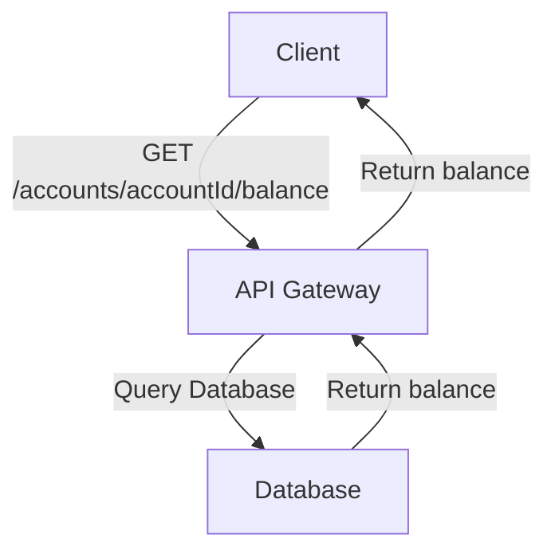
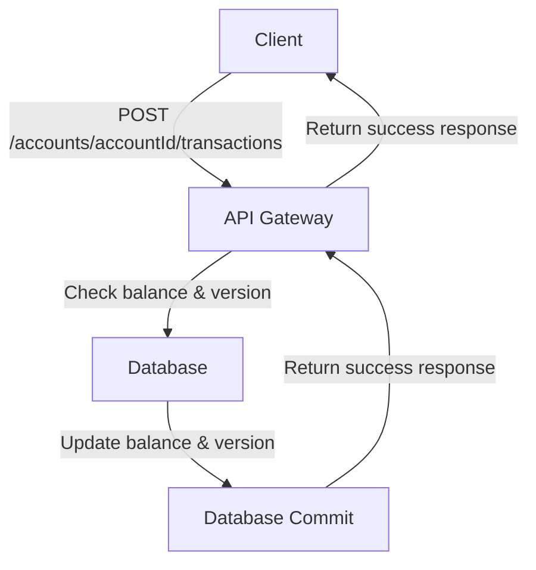
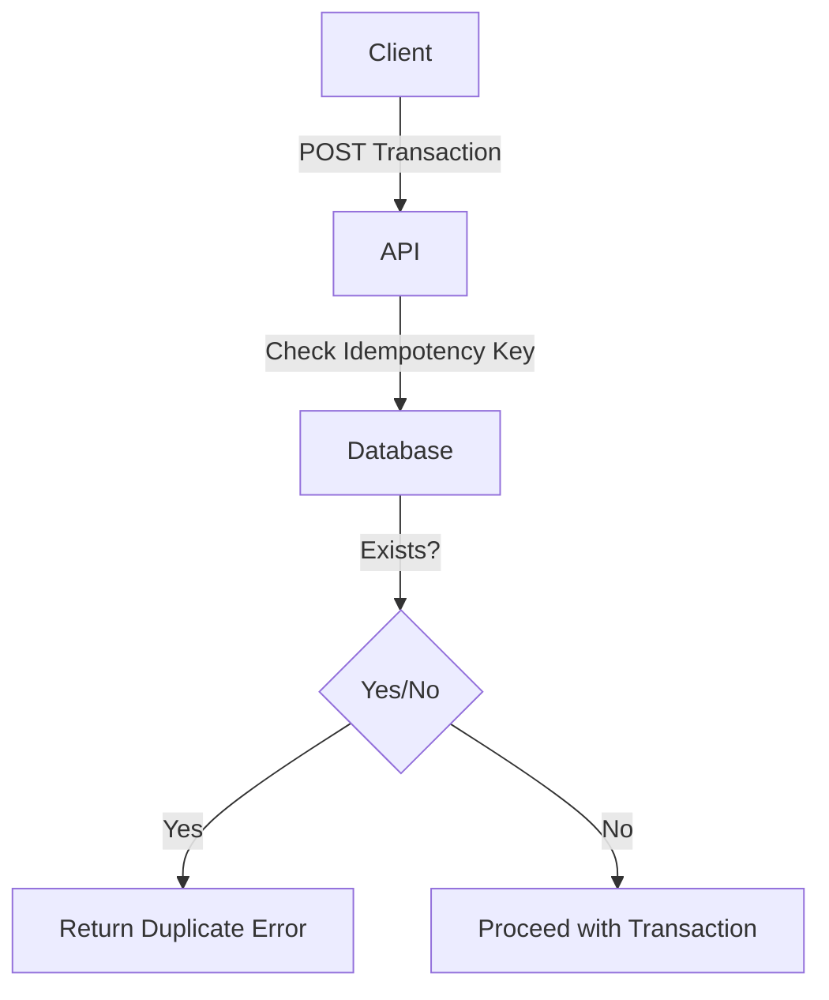
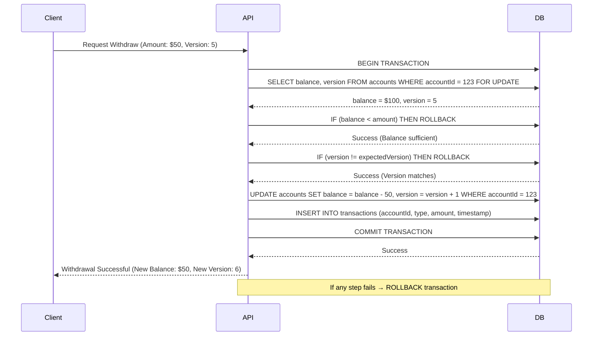
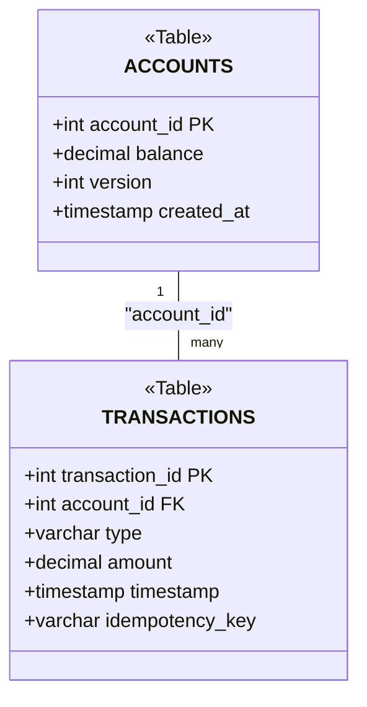
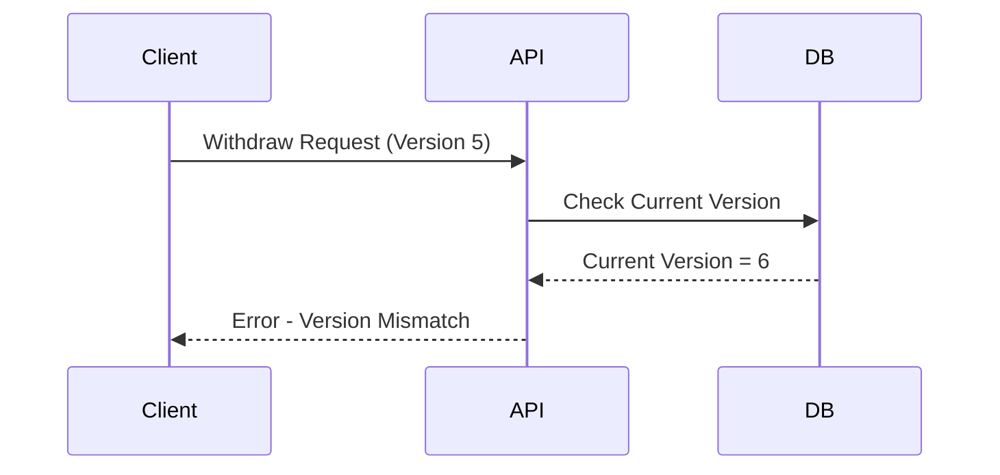

# Scalable Banking API

## 1. System Architecture
```mermaid
graph TD
    subgraph Client_Side
        A[Client] -->|API Requests| B[API Gateway]
    end

    subgraph API_Layer
        B[API Gateway] -->|Route Request| C[Accounts Service]
        B --> D[Transaction Service]
    end

    subgraph Database_Layer
        C -->|Fetch & Update| E[Accounts DB]
        D -->|Process & Store| F[Transactions DB]
    end

    subgraph Caching_&_Optimization
        C -->|Check Cache| G[Redis Cache]
        G -->|Return Cached Balance| C
    end

    subgraph Concurrency_&_Atomicity
        D -->|Version Check| H[Optimistic Locking]
        H -->|Ensure Consistency| F
    end

    subgraph External_Services
        D -->|Process Payments| I[Payment Gateway]
    end
  ```
---

## Task-1

### 1. Get Account Balance (GET /accounts/{accountId}/balance)

Retrieves current balance.

**Example response:**

```json
{
    "balance": 350.00,
    "version": 12
}

```
### Diagram:


### 2. Post Account (Debit, Credit) (POST /accounts/{accountId}/transactions)

Allows credit or deposit into the account.

**Example request:**

```json
{
    "moneyWithdraw/Deposit": 49,
    "typeOfTransaction": "Deposit",
    "expectedversion": 7
}

```

**Example response:**

```json
{
    "id": "tpn131",
    "type": "Deposit",
    "amount": 100.00,
    "newBalance": 400.00,
    "newVersion": "8",
    "timestamp": "2025-05-02T10:24:02Z"
}
```
### Diagram:



### Flow:

```mermaid

```

### 3. Error Handling (POST /accounts/{accountId}/transactions)

#### (A) Insufficient Balance

**Status Code:** 422

```json
{
    "error": "Insufficient Balance"
}
```


#### (B) Handle Concurrent Requests

**Status Code:** 409

```json
{
    "error": "Version mismatch",
    "CurrentVersion": 6
}

```

#### (C) Server Crashes

**Status Code:** 408

```json
{
    "error": "Server Crashes",
    "CurrentVersion": 5
}

```

## Atomicity & Concurrency Handling

### Atomicity

-   If a request fails at any stage, the transaction is either fully completed or fully reverted.

### Concurrent Requests

-   Uses versioning: Before updating, the API checks if the expected version matches the database version.
-   Uses Idempotency-Key to avoid duplicate transactions.

**Example Duplicate Transaction Response:**

```json
{
    "error": "Duplicate transaction",
    "transactionId": "txn131"
}

```
### Diagram:


## **3. Consistency Mechanisms in Transactions**

### **A) Strong Consistency with Atomic Transactions**

Ensures **all or nothing** updates using SQL transactions.
```json
BEGIN TRANSACTION;

-- Step 1: Check balance & version
SELECT balance, version FROM accounts WHERE accountId = 1 FOR UPDATE;

-- Step 2: Verify version
IF current_version != expected_version THEN
    ROLLBACK;
    RETURN ERROR 'Version mismatch';
END IF;

-- Step 3: Update balance & increment version
UPDATE accounts 
SET balance = balance - 50, version = version + 1
WHERE accountId = 1;

COMMIT;
```
### **B) Diagram**


## Database Schema

Using SQL for strong consistency and efficient locking.

### Schema

```sql
CREATE TABLE accounts (
    accountId SERIAL PRIMARY KEY,
    balance DECIMAL(18,2) NOT NULL CHECK (balance >= 0),
    version INT NOT NULL CHECK (version > 0)
);

CREATE TABLE transactions (
    transactionId SERIAL PRIMARY KEY,
    accountId INT NOT NULL REFERENCES accounts(accountId) ON DELETE CASCADE,
    type VARCHAR(10) NOT NULL CHECK (type IN ('debit', 'credit')),
    amount DECIMAL(18,2) NOT NULL CHECK (amount > 0),
    timestamp TIMESTAMP DEFAULT CURRENT_TIMESTAMP,
    idempotencyKey VARCHAR(255) NULL,
    CONSTRAINT unique_idempotency_per_account UNIQUE (accountId, idempotencyKey)
);

```
### Diagram:


## Race Conditions & Optimizations

-   **Version mismatch check** prevents outdated balance updates.
-   **Rollback on failure** using transactions.
-   **Concurrency control** using versioning & FOR UPDATE locks.
-   **Atomicity** using BEGIN TRANSACTION and COMMIT.
### Diagram:



### Optimizations for High Performance

-   **Connection Pooling**: Use PgBouncer to reuse DB connections.
-   **CQRS**: Separate read and write operations (Redis for reads, SQL for writes).
-   **Sharding**: Distribute accounts across multiple databases to improve scalability.
-   **Caching**: Use Redis or Memcached to store frequently accessed balances.
-   **Rate Limiting**: Prevent abuse by limiting transactions per second per user.
-   **Event-Driven Architecture**: Use Kafka or RabbitMQ for processing transactions asynchronously.

## API Implementation

# Bank Withdrawal API with Concurrency Handling

## `api.py`
```python
from flask import Flask, request, jsonify
from flask_sqlalchemy import SQLAlchemy
import threading
import locale

locale.setlocale(locale.LC_ALL, 'en_US.UTF-8')

app = Flask(__name__)

# Database configuration (SQLite for simplicity, can be replaced with PostgreSQL/MySQL)
app.config['SQLALCHEMY_DATABASE_URI'] = 'sqlite:///bank.db'
app.config['SQLALCHEMY_TRACK_MODIFICATIONS'] = False
db = SQLAlchemy(app)
balance_lock = threading.Lock()

class Account(db.Model):
    id = db.Column(db.String(10), primary_key=True)
    balance = db.Column(db.Float, nullable=False, default=1000.00)

with app.app_context():
    db.create_all()
    if not Account.query.filter_by(id="12345").first():
        db.session.add(Account(id="12345", balance=1000.00))
        db.session.commit()

@app.route('/withdraw', methods=['POST'])
def withdraw():
    data = request.get_json()
    account_id = data.get('account_id')
    amount = data.get('amount')

    if not account_id or not amount or amount <= 0:
        return jsonify({"error": "Invalid request"}), 400

    with balance_lock:  # Ensure thread safety
        session = db.session
        try:
            account = session.query(Account).filter_by(id=account_id).with_for_update().first()
            if not account:
                return jsonify({"error": "Account not found"}), 404
            if account.balance < amount:
                return jsonify({"account_id": account_id, "error": "Insufficient funds"}), 400

            account.balance -= amount
            session.commit()  # Save changes
            return jsonify({
                "account_id": account_id,
                "message": "Withdrawal successful",
                "new_balance": locale.currency(account.balance, grouping=True)  # Format as currency
            })
        except Exception as e:
            session.rollback()
            return jsonify({"error": "Transaction failed", "details": str(e)}), 500
        finally:
            session.close()

if __name__ == '__main__':
    app.run(debug=True)
```
## `reset_balance.py`
```mermoid
from flask import Flask
from api import db, Account  # Import database and Account model from api.py

app = Flask(__name__)
app.config['SQLALCHEMY_DATABASE_URI'] = 'sqlite:///bank.db'
app.config['SQLALCHEMY_TRACK_MODIFICATIONS'] = False
db.init_app(app)

# Reset balance within app context
with app.app_context():
    account = Account.query.filter_by(id="12345").first()
    if account:
        account.balance = 1000.00  # Reset balance to initial state
        db.session.commit()
        print("Balance reset to 1000.00")
    else:
        print("Account not found. Ensure API was initialized properly.")

```
## `test_concurrency.py`
```mermoid
import requests
import threading

URL = "http://127.0.0.1:5000/withdraw"
account_id = "12345"

def make_request(amount):
    response = requests.post(URL, json={"account_id": account_id, "amount": amount})
    print(response.json())

# Simulate 10 concurrent withdrawals
threads = []
for i in range(10):
    t = threading.Thread(target=make_request, args=(200,))
    threads.append(t)
    t.start()

for t in threads:
    t.join()

```

### api.py

-   Flask-based API using SQLAlchemy ORM.
-   Thread-safety ensured with balance_lock.
-   Uses versioning and row locks for concurrency.
-   Implements **sharding**, **caching**, and **asynchronous event processing**.

### test_concurrency.py

-   Simulates **10 concurrent withdrawal requests**.
-   Uses Python requests and threading to test API concurrency handling.

### reset_balance.py

-   Resets account balance to **1000.00**.

----------

The system is designed for **high scalability and fault tolerance**. 
