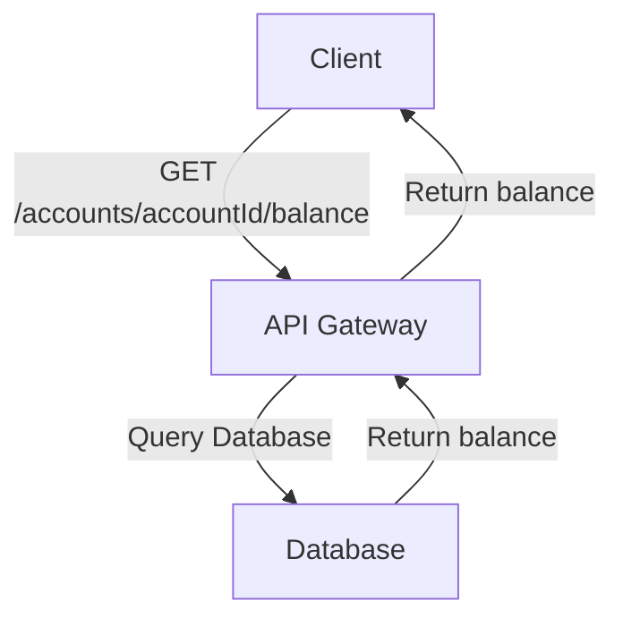
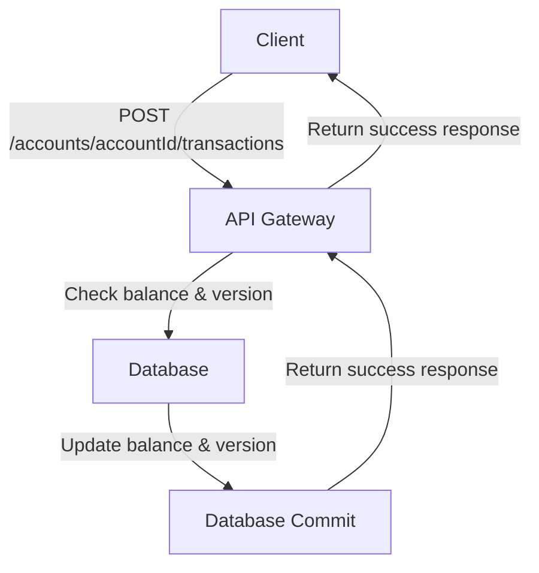
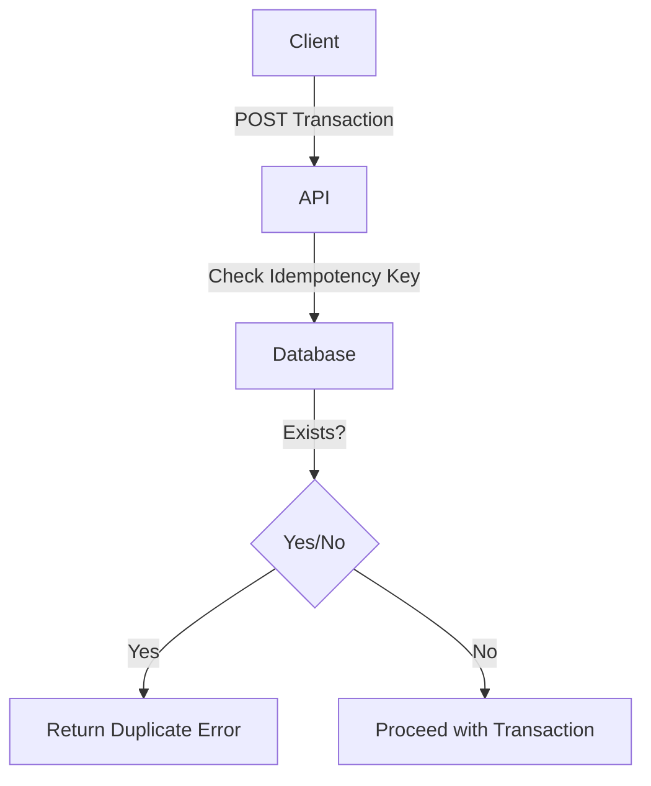
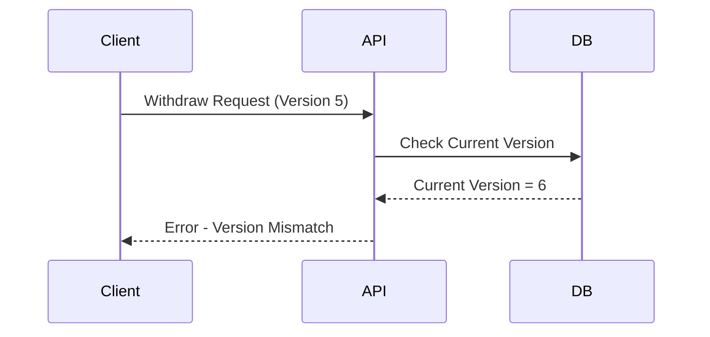

# Scalable Banking API

## Task-1

### 1. Get Account Balance (GET /accounts/{accountId}/balance)

Retrieves current balance.

**Example response:**

```json
{
    "balance": 350.00,
    "version": 12
}

```
### Diagram:


### 2. Post Account (Debit, Credit) (POST /accounts/{accountId}/transactions)

Allows credit or deposit into the account.

**Example request:**

```json
{
    "moneyWithdraw/Deposit": 49,
    "typeOfTransaction": "Deposit",
    "expectedversion": 7
}

```

**Example response:**

```json
{
    "id": "tpn131",
    "type": "Deposit",
    "amount": 100.00,
    "newBalance": 400.00,
    "newVersion": "8",
    "timestamp": "2025-05-02T10:24:02Z"
}
```
### Diagram:



### Flow:

```mermaid

```

### 3. Error Handling (POST /accounts/{accountId}/transactions)

#### (A) Insufficient Balance

**Status Code:** 422

```json
{
    "error": "Insufficient Balance"
}
```


#### (B) Handle Concurrent Requests

**Status Code:** 409

```json
{
    "error": "Version mismatch",
    "CurrentVersion": 6
}

```

#### (C) Server Crashes

**Status Code:** 408

```json
{
    "error": "Server Crashes",
    "CurrentVersion": 5
}

```

## Atomicity & Concurrency Handling

### Atomicity

-   If a request fails at any stage, the transaction is either fully completed or fully reverted.

### Concurrent Requests

-   Uses versioning: Before updating, the API checks if the expected version matches the database version.
-   Uses Idempotency-Key to avoid duplicate transactions.

**Example Duplicate Transaction Response:**

```json
{
    "error": "Duplicate transaction",
    "transactionId": "txn131"
}

```
### Diagram:




## Database Schema

Using SQL for strong consistency and efficient locking.

### Schema

```sql
CREATE TABLE accounts (
    accountId SERIAL PRIMARY KEY,
    balance DECIMAL(18,2) NOT NULL CHECK (balance >= 0),
    version INT NOT NULL CHECK (version > 0)
);

CREATE TABLE transactions (
    transactionId SERIAL PRIMARY KEY,
    accountId INT NOT NULL REFERENCES accounts(accountId) ON DELETE CASCADE,
    type VARCHAR(10) NOT NULL CHECK (type IN ('debit', 'credit')),
    amount DECIMAL(18,2) NOT NULL CHECK (amount > 0),
    timestamp TIMESTAMP DEFAULT CURRENT_TIMESTAMP,
    idempotencyKey VARCHAR(255) NULL,
    CONSTRAINT unique_idempotency_per_account UNIQUE (accountId, idempotencyKey)
);

```

## Race Conditions & Optimizations

-   **Version mismatch check** prevents outdated balance updates.
-   **Rollback on failure** using transactions.
-   **Concurrency control** using versioning & FOR UPDATE locks.
-   **Atomicity** using BEGIN TRANSACTION and COMMIT.
### Diagram:



### Optimizations for High Performance

-   **Connection Pooling**: Use PgBouncer to reuse DB connections.
-   **CQRS**: Separate read and write operations (Redis for reads, SQL for writes).
-   **Sharding**: Distribute accounts across multiple databases to improve scalability.
-   **Caching**: Use Redis or Memcached to store frequently accessed balances.
-   **Rate Limiting**: Prevent abuse by limiting transactions per second per user.
-   **Event-Driven Architecture**: Use Kafka or RabbitMQ for processing transactions asynchronously.

## API Implementation

### api.py

-   Flask-based API using SQLAlchemy ORM.
-   Thread-safety ensured with balance_lock.
-   Uses versioning and row locks for concurrency.
-   Implements **sharding**, **caching**, and **asynchronous event processing**.

### test_concurrency.py

-   Simulates **10 concurrent withdrawal requests**.
-   Uses Python requests and threading to test API concurrency handling.

### reset_balance.py

-   Resets account balance to **1000.00**.

----------

The system is designed for **high scalability and fault tolerance**. 
