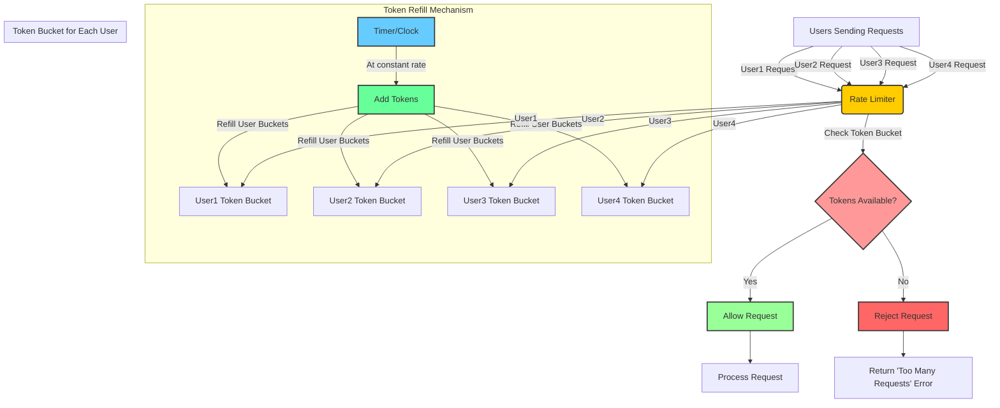

# Aryan Assessment - Q3 (Rate Limiting)

## Task 1

There are different approaches to implement rate limiting. We will discuss two of them:

1.  **Token Bucket Algorithm** (implemented by Stripe)
2.  **Leaky Bucket Algorithm**

----------

## Token Bucket Algorithm

The **Token Bucket** analogy is simple and consists of a **bucket** that holds **tokens**.

### How It Works:

1.  Picture a bucket in your mind.
2.  Fill the bucket with tokens at a **constant rate**.
3.  When a packet arrives, check if **any token** is in the bucket.
4.  If a token is available, **consume it and forward the request**.
5.  If the bucket is empty, **drop the packet**.

### Diagram:


----------

## Leaky Bucket Algorithm

The **Leaky Bucket** algorithm controls congestion by sending packets at a **constant rate**.

### How It Works:

1.  Consider a bucket with a **small hole at the bottom**.
2.  Water (packets) is poured at **random intervals**.
3.  Regardless of how much water is in the bucket, it **leaks at a constant rate**.
4.  If the bucket is full, **excess water (packets) is lost**.

### Key Points:

-   The **leak rate** is **independent** of the bucket's current state.
-   If the bucket is **full**, incoming packets **are discarded**.
-   The **output is at a constant rate**, ensuring **traffic smoothing**.

### Diagram:

```mermaid
graph TD;
    A[Leaky Bucket] -->|Packets Arrive Randomly| B[Bucket (Stores Packets)]
    B -->|Packets Sent at Constant Rate| C[Transmit Packet]
    B -->|Bucket Full?| D{Overflow?}
    D -- Yes --> E[Drop Packet]
    D -- No --> C

```

----------

## Token Bucket Algorithm Implementation (Java)

```java
import java.util.concurrent.*;
import java.time.LocalTime;
import java.time.format.DateTimeFormatter;

class TokenBucket {
    private int availableTokens;
    private final int bucketCapacity;
    private long lastRefillTimestamp;
    private static final int TOKENS_PER_SECOND = 5;

    public TokenBucket(int bucketCapacity) {
        this.availableTokens = bucketCapacity;
        this.bucketCapacity = bucketCapacity;
        this.lastRefillTimestamp = System.nanoTime();
    }

    private synchronized void refillTokens() {
        long currentTime = System.nanoTime();
        long elapsedTime = currentTime - lastRefillTimestamp;
        int tokensToAdd = (int) (TimeUnit.NANOSECONDS.toSeconds(elapsedTime)) * TOKENS_PER_SECOND;

        if (tokensToAdd > 0) {
            availableTokens = Math.min(bucketCapacity, availableTokens + tokensToAdd);
            lastRefillTimestamp = currentTime;
        }
    }

    public synchronized boolean tryConsumeToken() {
        refillTokens();
        if (availableTokens > 0) {
            availableTokens--;
            return true;
        }
        return false;
    }
}

class RateLimiter {
    private static final int MAX_TOKENS = 5;
    private final ConcurrentHashMap<String, TokenBucket> userTokenBuckets = new ConcurrentHashMap<>();

    public boolean isRequestAllowed(String userId) {
        return userTokenBuckets.computeIfAbsent(userId, k -> new TokenBucket(MAX_TOKENS)).tryConsumeToken();
    }
}

public class Main {
    private static final DateTimeFormatter TIME_FORMATTER = DateTimeFormatter.ofPattern("HH:mm:ss.SSS");

    public static void main(String[] args) {
        RateLimiter rateLimiter = new RateLimiter();
        ExecutorService executorService = Executors.newFixedThreadPool(10);

        for (int i = 0; i < 20; i++) {
            final String userId = "User" + (i % 4);
            executorService.execute(() -> {
                for (int j = 0; j < 10; j++) {
                    String timestamp = LocalTime.now().format(TIME_FORMATTER);
                    if (rateLimiter.isRequestAllowed(userId)) {
                        System.out.println(timestamp + " " + userId + " - Request allowed");
                    } else {
                        System.out.println(timestamp + " " + userId + " - Request denied");
                    }
                    try {
                        Thread.sleep(200);
                    } catch (InterruptedException e) {
                        Thread.currentThread().interrupt();
                    }
                }
            });
        }

        executorService.shutdown();
    }
}

```

### **Output:**

Each user can make only **5 requests per second**, and excess requests are **denied**.

----------

## **Breakdown of Implementation**

### **1. TokenBucket Class**

-   **availableTokens**: Number of tokens available.
-   **bucketCapacity**: Maximum tokens the bucket can hold.
-   **lastRefillTimestamp**: Time when last refill happened.
-   **TOKENS_PER_SECOND**: Tokens added per second.
-   **tryConsumeToken()**: Checks and updates token count.

### **2. RateLimiter Class**

-   Uses a **ConcurrentHashMap** to manage multiple users' buckets.
-   **isRequestAllowed(userId)**: Determines if a request should be accepted or denied.

### **3. Main Class (Execution)**

-   Simulates multiple users making requests.
-   Uses **multi-threading** to mimic real-world concurrent requests.
-   Ensures each user **only makes 5 requests per second**.

----------

## **Data Structure Used**

-   **HashMap (ConcurrentHashMap)** is used to track **requests per user** efficiently.

----------

## **Trade-Off: Token Bucket vs. Leaky Bucket**

Feature

Token Bucket

Leaky Bucket

**Rate Control**

Allows bursts

Smoothens traffic

**Latency**

Lower

Higher

**Implementation**

Easier

More complex

**Traffic Handling**

Handles bursts well

Enforces strict rate

**Request Denial**

When empty

When full

### **When to Use Which?**

-   **Use Token Bucket** when allowing bursts (e.g., API requests, network throttling).
-   **Use Leaky Bucket** when traffic needs to be **evenly spread** (e.g., VoIP, streaming services).

----------
